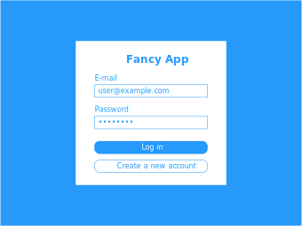
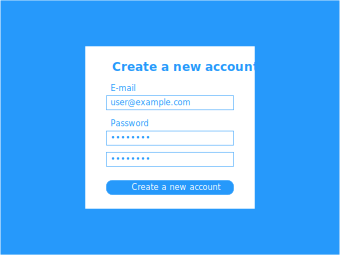
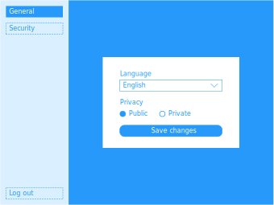

### Specifications

Fancy app is a web-based application that allows users to create a new account, log in, change the settings, change the password, delete their accounts, and log out.

E-mails, passwords and user's settings are persistently stored in the database.

The language choices are English, French, German, Japanese, Chinese, Korean, and Thai.

### Instructions

- You are instructed to recreate the website according to the specifications above.
- You must use the following technologies:
  - JavaScript (ES6+) or TypeScript v2+
  - Node.js v8+
  - NPM or Yarn
  - React v16+
  - Styled components, Emotion, styled-jsx, LESS, SCSS, or Stylus
  - MongoDB
- **You must not** use the following third-party libraries:
  - Any public web UI frameworks, for example, [Bootstrap](http://getbootstrap.com/), [Semantic UI](http://semantic-ui.com/), [Material UI](https://material-ui.com/), or [Ant Design](https://ant.design/) -- you may borrow the design, but you have to come up with your own style sheets. However, you will not be judged by the appearance of your web.
  - jQuery
- You may use any other third-party libraries that are not in the exception list above.
- You must be able to explain the reasons behind your code changes along with its trade-off in a verbal interview or a written document.
- You must ensure running your web on a local machine, for example, `http://localhost:1234/`, regardless of an environment.
- You must add at least one test case of your choice using black-box testing technique.
- You must use Git as a version control.

### Expectations

You will be judged by the following criteria.
- Functionality is correct with respect to the specifications.
- Good security principles are followed, for example, [OWASP Top 10 2017](https://www.owasp.org/images/7/72/OWASP_Top_10-2017_%28en%29.pdf.pdf).
- Good software engineering principles are followed, for example, [SOLID principles](https://en.wikipedia.org/wiki/SOLID).
- [Node.js production practices](https://www.joyent.com/node-js/production) are followed, especially [the error handling](https://www.joyent.com/node-js/production/design/errors).
- Identifiers are named meaningfully and consistently.
- High coupling code blocks are adjacent to each other.
- Errors are handled and exposed to users beautifully.
- Good choice of data structure is used.
- Consistent indentation and formatting are followed.
- Indirection is minimized as much as possible, while still maintaining flexibility.
- Git commit messages clearly state the reason of the change.
- Over-engineering and under-engineering are avoided.
- Automation testing covers the main functionality of the under-testing components.

**Taskworld expects you to put great effort into your work with the highest attention to detail.** Our mission is to build high quality code to delight our customers. Therefore, please work on this assignment as if you are building a production-grade application, and make sure to test the app thoroughly, verifying that it works in both successful and error cases, as well as in cases of bad network conditions.

Taskworld reserves the right, in its sole discretion, to disqualify any candidate that does not comply with any of the above, even before the work is submitted.

By submitting this challenge you agree that any writings or images you submitted may be used by Taskworld.
